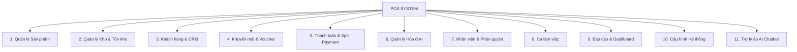
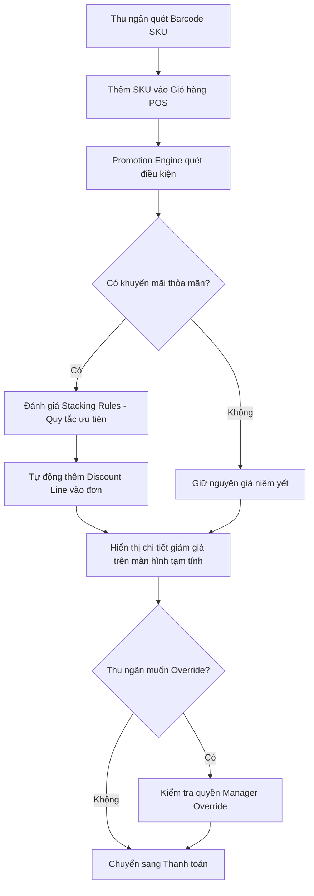
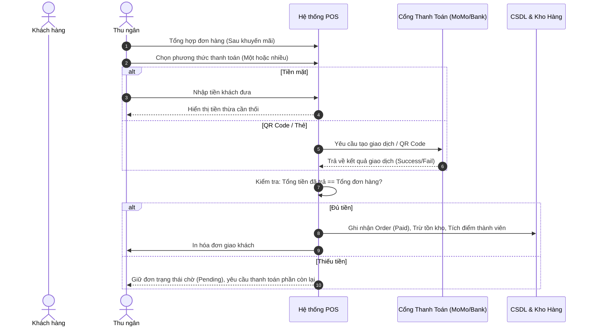
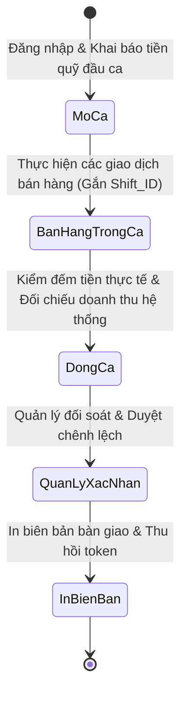
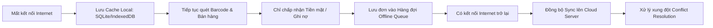

# TÀI LIỆU PHÂN TÍCH LOGIC NGHIỆP VỤ HỆ THỐNG POS (POS BUSINESS LOGIC)

> Tài liệu chuẩn hóa toàn bộ luồng nghiệp vụ (Business Logic), quy tắc tính toán, phân quyền và các kịch bản xử lý trong hệ thống **POS-System**.

---

## 📑 MỤC LỤC

- [1. TỔNG QUAN HỆ THỐNG](#1-tổng-quan-hệ-thống)
- [2. MODULE QUẢN LÝ SẢN PHẨM](#2-module-quản-lý-sản-phẩm)
  - [2.1 Danh mục sản phẩm (Category)](#21-danh-mục-sản-phẩm-category)
  - [2.2 Sản phẩm & SKU](#22-sản-phẩm--sku)
  - [2.3 Quản lý giá](#23-quản-lý-giá)
- [3. MODULE QUẢN LÝ KHO & TỒN KHO](#3-module-quản-lý-kho--tồn-kho)
  - [3.1 Nhập kho (Stock In)](#31-nhập-kho-stock-in)
  - [3.2 Xuất kho (Stock Out)](#32-xuất-kho-stock-out)
  - [3.3 Kiểm kê (Stock Take)](#33-kiểm-kê-stock-take)
  - [3.4 Tồn kho & Cảnh báo](#34-tồn-kho--cảnh-báo)
  - [3.5 Nhà cung cấp (Supplier)](#35-nhà-cung-cấp-supplier)
- [4. MODULE QUẢN LÝ KHÁCH HÀNG & CRM](#4-module-quản-lý-khách-hàng--crm)
  - [4.1 Đăng ký thành viên](#41-đăng-ký-thành-viên)
  - [4.2 Hạng thành viên & Tích điểm](#42-hạng-thành-viên--tích-điểm)
  - [4.3 Chăm sóc khách hàng (CRM)](#43-chăm-sóc-khách-hàng-crm)
  - [4.4 Trợ lý ảo (Chatbot AI)](#44-trợ-lý-ảo-chatbot-ai)
- [5. MODULE KHUYẾN MÃI / VOUCHER](#5-module-khuyến-mãi--voucher)
  - [5.1 Các loại hình khuyến mãi](#51-các-loại-hình-khuyến-mãi)
  - [5.2 Quy trình tự động áp Promotion Engine](#52-quy-trình-tự-động-áp-promotion-engine)
- [6. MODULE THANH TOÁN (PAYMENT)](#6-module-thanh-toán-payment)
  - [6.1 Phương thức thanh toán](#61-phương-thức-thanh-toán)
  - [6.2 Luồng xử lý thanh toán (Bao gồm Split Payment)](#62-luồng-xử-lý-thanh-toán-bao-gồm-split-payment)
- [7. MODULE HÓA ĐƠN (INVOICE)](#7-module-hóa-đơn-invoice)
  - [7.1 Sinh hóa đơn](#71-sinh-hóa-đơn)
  - [7.2 In & Xuất hóa đơn](#72-in--xuất-hóa-đơn)
  - [7.3 Lưu ý về Hóa đơn điện tử (E-Invoice)](#73-lưu-ý-về-hóa-đơn-điện-tử-e-invoice)
- [8. MODULE NHÂN VIÊN, PHÂN QUYỀN & QUẢN LÝ CỬA HÀNG](#8-module-nhân-viên-phân-quyền--quản-lý-cửa-hàng)
  - [8.1 Bảng ma trận vai trò (Roles Matrix)](#81-bảng-ma-trận-vai-trò-roles-matrix)
  - [8.2 Quản lý nhân viên](#82-quản-lý-nhân-viên)
  - [8.3 Quản lý cửa hàng (Dành cho Chủ chuỗi)](#83-quản-lý-cửa-hàng-dành-cho-chủ-chuỗi)
- [9. MODULE CA LÀM VIỆC (SHIFT WORK)](#9-module-ca-làm-việc-shift-work)
  - [9.1 Mở ca (Open Shift)](#91-mở-ca-open-shift)
  - [9.2 Đóng ca (Close Shift)](#92-đóng-ca-close-shift)
- [10. MODULE BÁO CÁO & DASHBOARD](#10-module-báo-cáo--dashboard)
  - [10.1 Dashboard tổng quan](#101-dashboard-tổng-quan)
  - [10.2 Báo cáo doanh thu](#102-báo-cáo-doanh-thu)
  - [10.3 Báo cáo tồn kho](#103-báo-cáo-tồn-kho)
  - [10.4 Xuất / Nhập dữ liệu (Import/Export)](#104-xuất--nhập-dữ-liệu-importexport)
- [11. CẤU HÌNH HỆ THỐNG](#11-cấu-hình-hệ-thống)
  - [11.1 Đa ngôn ngữ (i18n)](#111-đa-ngôn-ngữ-i18n)
  - [11.2 Đa tiền tệ](#112-đa-tiền-tệ)
  - [11.3 Barcode & Chế độ Offline](#113-barcode--chế-độ-offline)

---

## 1. TỔNG QUAN HỆ THỐNG

Hệ thống **POS-System** là giải pháp bán lẻ đa chức năng (Multi-store, Omnichannel-ready) bao gồm **11 module chính**:



---

## 2. MODULE QUẢN LÝ SẢN PHẨM

### 2.1 Danh mục sản phẩm (Category)
- **Cấu trúc phân cấp**: Hỗ trợ cây đa cấp (*Danh mục cha - Danh mục con*).
  - *Ví dụ*: `Đồ uống` > `Nước ngọt` > `Có gas`.
- **Thao tác nghiệp vụ**:
  - CRUD danh mục, cấu hình thứ tự hiển thị (`DisplayOrder`).
  - Ẩn/hiện trên màn hình bán hàng POS.
  - Gắn hình ảnh đại diện danh mục (tối ưu cho màn hình cảm ứng POS chạm chọn nhanh).

### 2.2 Sản phẩm & SKU
- **Sản phẩm cha (Product)**:
  - Thông tin định danh: Tên sản phẩm, mô tả, danh mục, thương hiệu.
  - Đơn vị tính cơ bản, ảnh đại diện, trạng thái (`Đang bán` / `Ngừng bán`).
- **SKU (Biến thể sản phẩm - Stock Keeping Unit)**:
  - Mỗi sản phẩm có nhiều SKU theo thuộc tính (*Size, Màu sắc, Dung tích, Hương vị...*).
  - **Mã SKU**: Tự sinh theo quy tắc hoặc nhập thủ công, liên kết Barcode/QR Code.
  - **Đơn vị tính (UoM)**: Hỗ trợ nhiều đơn vị tính với bảng quy đổi (*vd: Cái, Lốc, Thùng*).
  - **Cơ cấu giá**: Giá vốn (`Cost Price`), Giá bán lẻ (`Retail Price`), Giá bán buôn (`Wholesale Price`).
  - **Thuế suất VAT**: Áp dụng theo từng SKU (`0%`, `5%`, `8%`, `10%`).

### 2.3 Quản lý giá
- **Bảng giá theo thời gian hiệu lực**: Thiết lập lịch trình tăng/giảm giá tự động theo khung thời gian.
- **Bảng giá theo phân khúc**: Bảng giá riêng theo nhóm khách hàng hoặc theo chi nhánh (Multi-store).
- **Lịch sử thay đổi giá (Audit Log)**: Ghi vết thời gian, giá cũ, giá mới và người thực hiện thay đổi.

---

## 3. MODULE QUẢN LÝ KHO & TỒN KHO

### 3.1 Nhập kho (Stock In)
- **Nhập từ Nhà cung cấp**:
  - Chọn nhà cung cấp (NCC), danh sách SKU, số lượng, giá nhập.
  - Tự động cập nhật giá vốn bình quân (nếu cấu hình) và tăng số lượng tồn.
- **Nhập từ trả hàng**: Nhập hoàn kho từ các đơn trả hàng của khách (`Return to stock`).
- **Chứng từ**: In phiếu nhập kho, lưu trữ lịch sử chứng từ.

### 3.2 Xuất kho (Stock Out)
- **Xuất bán**: Tự động trừ tồn kho ngay khi đơn hàng hoàn tất thanh toán.
- **Xuất hủy**: Hàng hỏng, hết hạn sử dụng, rơi vỡ — bắt buộc nhập lý do xuất hủy và đính kèm phê duyệt.

### 3.3 Kiểm kê (Stock Take)
- **Tạo phiếu kiểm kê**: Theo từng kho, từng danh mục hoặc toàn bộ cửa hàng.
- **Quét kiểm đếm**: Nhân viên quét barcode đếm thực tế $\rightarrow$ Hệ thống tự động đối chiếu với số tồn hệ thống.
- **Xử lý chênh lệch**: Xuất báo cáo thừa/thiếu, yêu cầu cấp Quản lý (`Manager`) phê duyệt trước khi cân bằng tồn kho.

### 3.4 Tồn kho & Cảnh báo
- **Tồn kho Real-time**: Theo dõi chi tiết theo từng SKU và từng chi nhánh/kho.
- **Cảnh báo Min Stock**: Cảnh báo khi tồn kho giảm xuống dưới mức tối thiểu $\rightarrow$ Gợi ý tạo đơn nhập hàng.
- **Cảnh báo Hạn dùng (Expiry Alert)**: Theo dõi theo Lô (`Batch`) và hạn sử dụng (`Expiry Date`).
- **Trạng thái hiển thị POS**:
  - 🟢 **Còn hàng** (`In Stock`)
  - 🟡 **Sắp hết** (`Low Stock`)
  - 🔴 **Hết hàng** (`Out of Stock`)

### 3.5 Nhà cung cấp (Supplier)
- Hồ sơ NCC: Tên, MST, người liên hệ, số điện thoại, địa chỉ, điều khoản công nợ.
- Lịch sử nhập hàng theo NCC.
- Theo dõi công nợ phải trả nhà cung cấp.

---

## 4. MODULE QUẢN LÝ KHÁCH HÀNG & CRM

### 4.1 Đăng ký thành viên
- **Thông tin thu thập**: Họ tên, Số điện thoại (*Primary Key/Định danh*), Ngày sinh, Email.
- **Mã thành viên**: Hệ thống tự sinh Barcode/QR Code định danh duy nhất cho khách hàng để quét tại quầy.

### 4.2 Hạng thành viên & Tích điểm
- **Phân hạng thành viên**:
  - Các cấp: `Thường` $\rightarrow$ `Bạc` $\rightarrow$ `Vàng` $\rightarrow$ `VIP`...
  - Tiêu chí thăng hạng: Dựa trên tổng chi tiêu tích lũy hoặc số lượt mua hàng trong kỳ.
- **Cơ chế tích & tiêu điểm**:
  - Tích điểm: $X\%$ giá trị đơn hàng $\rightarrow$ Điểm thưởng (hoặc tích lũy theo mốc).
  - Tiêu điểm: Quy đổi điểm thành tiền giảm giá trực tiếp vào hóa đơn.
  - Lịch sử giao dịch: Lưu chi tiết biến động điểm (Tích điểm / Tiêu điểm / Hết hạn).

### 4.3 Chăm sóc khách hàng (CRM)
- **Tiếp nhận phản hồi**: Ghi nhận khiếu nại, góp ý, khen ngợi từ khách hàng tại quầy hoặc qua hotline/zalo/email.
- **Phân loại & Liên kết**: Gắn khiếu nại với mã khách hàng và hóa đơn mua hàng liên quan.
- **Quy trình xử lý Ticket**:
  ```
  [Mới tiếp nhận] ──> [Đang xử lý] ──> [Đã xử lý] ──> [Đóng Ticket]
  ```
  - Phân công nhân viên phụ trách, lưu vết trao đổi xử lý.
- **Báo cáo CRM**: Tần suất khiếu nại theo nhóm nguyên nhân, thời gian xử lý trung bình (SLA), so sánh chất lượng giữa các cửa hàng.

### 4.4 Trợ lý ảo (Chatbot AI)
- **Kênh tương tác**: Widget web nhúng trên trang portal/website cửa hàng; khách hàng truy cập từ điện thoại cá nhân không cần cài app.
- **Năng lực AI**: Tự động tra cứu thông tin sản phẩm, tình trạng còn hàng, chính sách đổi trả, ưu đãi hiện hành.
- **Quản lý phiên**: Lưu vết lịch sử trò chuyện theo Session ID, liên kết thông tin khách hàng nếu đã đăng nhập.
- **Fallback Rule**: Nếu câu hỏi nằm ngoài phạm vi tri thức $\rightarrow$ Phản hồi lịch sự và cung cấp thông tin liên hệ trực tiếp của cửa hàng.
- **Kiểm soát chi phí**: Giới hạn số lượt tương tác (message limit) trên mỗi phiên chat.

---

## 5. MODULE KHUYẾN MÃI / VOUCHER

### 5.1 Các loại hình khuyến mãi

| Loại Khuyến Mãi | Mô Tả Nghiệp Vụ | Ví Dụ |
| :--- | :--- | :--- |
| **Chiết khấu trực tiếp** | Giảm theo $\%$ hoặc số tiền cố định trên SKU/Danh mục/Tổng đơn | Giảm 10% tổng đơn trên 500k |
| **Combo / Mua X tặng Y** | Mua số lượng $X$ được tặng/giảm giá sản phẩm $Y$ | Mua 2 trà sữa tặng 1 pudding |
| **Voucher Code** | Nhập mã voucher (1 lần / nhiều lần, giới hạn số lượt, gắn khách) | Mã `CHAOBANMOI` giảm 30k |
| **Happy Hour** | Áp dụng tự động theo khung giờ vàng hoặc ngày trong tuần | Giảm 20% từ 14:00 - 16:00 T2-T6 |
| **Ưu đãi hạng thẻ** | Áp dụng theo cấp bậc thành viên | Thẻ VIP giảm 5% mọi hóa đơn |

### 5.2 Quy trình tự động áp Promotion Engine

> [!IMPORTANT]
> **Promotion Engine** hoạt động tự động và tức thời sau mỗi lần quét mã barcode sản phẩm vào giỏ hàng.



- **Quy tắc ưu tiên (Stacking Rules)**:
  1. Khuyến mãi cấp dòng sản phẩm (Line-item discount) được tính trước.
  2. Khuyến mãi cấp hóa đơn (Order-level discount) được tính trên tổng sau khi trừ chiết khấu dòng.
  3. Cấu hình rõ ràng chính sách: *Được phép cộng dồn* hay *Chọn ưu đãi có giá trị cao nhất*.
- **Quyền Override**: Thu ngân chỉ được hủy áp khuyến mãi hoặc sửa giảm giá khi có sự can thiệp và phê duyệt của `Manager`/`Admin`.

---

## 6. MODULE THANH TOÁN (PAYMENT)

### 6.1 Phương thức thanh toán

```
┌────────────────────────────────────────────────────────────────────────┐
│                        PHƯƠNG THỨC THANH TOÁN                         │
├─────────────────┬──────────────────┬─────────────────┬────────────────┤
│ 💵 Tiền mặt     │ 📱 MoMo QR /     │ 💳 Thẻ POS      │ 🔀 Split       │
│    (Cash)       │    VietQR        │    (Card)       │    Payment     │
│                 │                  │                 │                │
│ Nhập tiền nhận  │ Dynamic QR code  │ Tích hợp POS    │ Phối hợp nhiều │
│ -> Tính tiền    │ -> Callback      │ cà thẻ / Nhập   │ phương thức    │
│    thối (Change)│    xác nhận      │    mã chuẩn chi │    cùng lúc    │
└─────────────────┴──────────────────┴─────────────────┴────────────────┘
```

- **Tiền mặt (`Cash`)**:
  $$\text{Tiền thối (Change)} = \text{Tiền khách đưa} - \text{Tổng tiền hóa đơn}$$
- **MoMo QR / VietQR**: Sinh mã QR động tương ứng với số tiền cần thanh toán $\rightarrow$ Lắng nghe Webhook/Callback xác thực giao dịch thành công.
- **Quẹt thẻ ngân hàng (`Card`)**: Kết nối máy POS ngân hàng qua giao thức mạng/Serial hoặc nhập tay mã tham chiếu giao dịch.
- **Thanh toán kết hợp (`Split Payment`)**: Cho phép chia khoản thanh toán trên cùng một đơn hàng (*ví dụ: 200k tiền mặt + 300k chuyển khoản QR*).

### 6.2 Luồng xử lý thanh toán (Bao gồm Split Payment)



---

## 7. MODULE HÓA ĐƠN (INVOICE)

### 7.1 Sinh hóa đơn
- **Điều kiện kích hoạt**: Hóa đơn chỉ được sinh ra khi đơn hàng đạt trạng thái **Đã thanh toán đủ** ($\sum \text{Thanh toán} = \text{Tổng giá trị đơn hàng}$).
- **Quy tắc sinh mã**: Mã số hóa đơn (`invoice_no`) tăng dần tự động, duy nhất theo từng cửa hàng (*vd: `HD-HCM01-20260905-0001`*).
- **Nội dung bắt buộc trên hóa đơn**:
  - Thông tin cửa hàng (Tên, địa chỉ, hotline, MST).
  - Thông tin khách hàng & Mã số thuế công ty (nếu có yêu cầu xuất HĐ VAT).
  - Danh sách SKU: Tên hàng hóa, số lượng, đơn giá, thành tiền, mức thuế VAT.
  - Tổng tiền hàng trước thuế, tổng tiền thuế VAT, chiết khấu khuyến mãi.
  - Tổng tiền thanh toán cuối cùng và chi tiết phương thức thanh toán.

### 7.2 In & Xuất hóa đơn
- **In nhiệt tại quầy**: Kết nối máy in nhiệt (khổ `58mm` hoặc `80mm`), tự động cắt giấy khi in xong.
- **In lại & Tra cứu**: Cho phép tra cứu lịch sử hóa đơn theo mã đơn hàng và in lại khi cần.
- **Xuất file điện tử**: Hỗ trợ xuất file PDF để lưu trữ hoặc gửi email trực tiếp cho khách hàng.

### 7.3 Lưu ý về Hóa đơn điện tử (E-Invoice)
> [!NOTE]
> - **Giai đoạn 1**: Hệ thống phát hành **Hóa đơn bán hàng nội bộ** phục vụ giao dịch tại quầy và đối soát ca.
> - **Giai đoạn 2 (Mở rộng)**: Sẵn sàng tích hợp API với các nhà cung cấp Hóa đơn điện tử hợp chuẩn (*Viettel, MISA, VNPT*) theo quy định của cơ quan Thuế.

---

## 8. MODULE NHÂN VIÊN, PHÂN QUYỀN & QUẢN LÝ CỬA HÀNG

### 8.1 Bảng ma trận vai trò (Roles Matrix)

| Chức Năng Nghiệp Vụ | Chủ Chuỗi (`Owner`) | Quản Trị Cửa Hàng (`Admin`) | Quản Lý Ca (`Manager`) | Thu Ngân (`Cashier`) |
| :--- | :---: | :---: | :---: | :---: |
| **Quản lý đa chi nhánh toàn chuỗi** | ✅ | ❌ | ❌ | ❌ |
| **Tạo cửa hàng mới & Gán Admin** | ✅ | ❌ | ❌ | ❌ |
| **Xem báo cáo tổng hợp toàn chuỗi** | ✅ | ❌ | ❌ | ❌ |
| **Quản lý nhân viên chi nhánh** | ✅ | ✅ | ❌ | ❌ |
| **Cấu hình sản phẩm, giá & khuyến mãi** | ✅ | ✅ | ❌ | ❌ |
| **Nhập kho / Xuất kho / Kiểm kê** | ✅ | ✅ | ✅ | ❌ |
| **Duyệt điều chỉnh tồn kho / Hủy đơn** | ✅ | ✅ | ✅ | ❌ |
| **Bán hàng, Quét barcode & Thu tiền** | ✅ | ✅ | ✅ | ✅ |
| **Mở ca & Đóng ca làm việc cá nhân** | ✅ | ✅ | ✅ | ✅ |

> [!TIP]
> Hệ thống hỗ trợ mô hình **RBAC (Role-Based Access Control)** mở rộng, cho phép tùy biến chi tiết quyền theo từng chức năng trong tương lai.

### 8.2 Quản lý nhân viên
- **Quản lý tài khoản**: Thêm mới, cập nhật hồ sơ, gán vai trò (`Role`) và chỉ định chi nhánh làm việc.
- **Bảo mật & Khóa tài khoản**:
  - Khóa tài khoản chủ động bởi Quản lý.
  - Tự động tạm khóa tài khoản khi nhập sai mã PIN/mật khẩu quá **5 lần liên tiếp**.
- **Cấp lại mật khẩu**: Hỗ trợ đặt lại mật khẩu hoặc cấp mã PIN mới.
- **Audit Logging**: Nhật ký ghi vết toàn bộ lượt Đăng nhập, Đăng xuất và các thao tác nhạy cảm.

### 8.3 Quản lý cửa hàng (Dành cho Chủ chuỗi)
- Khởi tạo cửa hàng mới: Tên chi nhánh, địa chỉ, số điện thoại, múi giờ (`Timezone`), tiền tệ mặc định (`VND`).
- Gán tài khoản Admin quản trị cho từng chi nhánh cụ thể.
- Cơ chế phân quyền đa cửa hàng cho tài khoản cấp cao.
- Chế độ tạm ngừng hoạt động chi nhánh (*Bảo lưu toàn vẹn dữ liệu lịch sử*).

---

## 9. MODULE CA LÀM VIỆC (SHIFT WORK)



### 9.1 Mở ca (Open Shift)
- Thu ngân đăng nhập vào ca làm việc trên máy POS.
- Khai báo số tiền mặt tồn quỹ đầu ca (`Opening Cash`).
- Hệ thống sinh `Shift_ID` duy nhất; toàn bộ giao dịch phát sinh trong phiên làm việc đều được gắn định danh này.

### 9.2 Đóng ca (Close Shift)
- **Tổng hợp tự động**: Hệ thống tổng kết doanh thu theo từng phương thức thanh toán phát sinh trong ca.
- **Kiểm đếm thực tế**: Thu ngân đếm tiền mặt thực tế trong két và nhập vào hệ thống.
- **Đối soát chênh lệch**: Hệ thống so sánh:
  $$\text{Chênh lệch} = \text{Tiền mặt thực tế} - (\text{Quỹ đầu ca} + \text{Doanh thu tiền mặt trong ca})$$
- **Xác nhận**: Quản lý ca ký duyệt biên bản bàn giao ca.
- **Bảo mật**: Thu hồi Token đăng nhập của ca hiện tại, bắt buộc đăng nhập mới cho ca tiếp theo.

---

## 10. MODULE BÁO CÁO & DASHBOARD

### 10.1 Dashboard tổng quan
- **Chỉ số kinh doanh trong ngày (Real-time)**:
  - Doanh thu tức thời (so sánh cùng kỳ hôm qua, tuần trước).
  - Số lượng đơn hàng đã hoàn tất.
  - Giá trị trung bình trên một đơn hàng (AOV - Average Order Value).
- **Biểu đồ xu hướng**: Diễn biến doanh thu 7 ngày / 30 ngày gần nhất (Dạng đường / Cột).
- **Top 5 Sản phẩm**: Top sản phẩm bán chạy nhất theo số lượng và theo doanh thu.
- **Cảnh báo vận hành nhanh**:
  - Số lượng SKU chạm ngưỡng sắp hết hàng (`Low Stock Alert`).
  - Số lượng phiếu kiểm kê kho đang chờ duyệt.
- **Góc nhìn Chủ chuỗi (Owner View)**: Bảng xếp hạng doanh số và tỷ lệ tăng trưởng giữa các chi nhánh trong chuỗi.

### 10.2 Báo cáo doanh thu
- Báo cáo theo thời gian: Theo giờ, ngày, tuần, tháng, quý, năm hoặc khoảng thời gian tùy chọn.
- Báo cáo theo cấu trúc: Theo chi nhánh, theo nhân viên bán hàng, theo ca làm việc (`Shift`).
- Báo cáo theo phương thức thanh toán: Tỷ trọng Tiền mặt / MoMo QR / Chuyển khoản / Thẻ.
- Báo cáo chiết khấu: Tổng giá trị giảm giá, hiệu quả từng chương trình khuyến mãi/voucher.

### 10.3 Báo cáo tồn kho
- Tồn kho tức thời theo từng kho, danh mục và mã SKU.
- Báo cáo tổng hợp **Nhập - Xuất - Tồn** theo kỳ kế toán.
- Báo cáo hàng chậm luân chuyển (`Slow-moving Items`), hàng cận date cần thanh lý.
- Báo cáo chênh lệch sau kiểm kê thực tế.

### 10.4 Xuất / Nhập dữ liệu (Import/Export)
- **Xuất báo cáo**: Hỗ trợ định dạng Excel (`.xlsx`), PDF, CSV với tiêu đề cột đa ngôn ngữ.
- **Nhập hàng loạt (Bulk Import)**: Hỗ trợ nạp dữ liệu từ file Excel cho danh mục sản phẩm, bảng giá mới và số dư tồn kho đầu kỳ.

---

## 11. CẤU HÌNH HỆ THỐNG

### 11.1 Đa ngôn ngữ (i18n)
- Giao diện người dùng áp dụng cơ chế dịch thuật dựa trên khóa (`Key-based Translation`), ví dụ: `vi.json`, `en.json`.
- Quản trị viên có thể bổ sung gói ngôn ngữ mới trực tiếp thông qua cấu hình hệ thống mà không cần build lại mã nguồn.

### 11.2 Đa tiền tệ
- Cấu hình loại tiền tệ mặc định theo từng cửa hàng (mặc định: `VND`, hỗ trợ `USD`, `EUR`...).
- Định dạng hiển thị số, dấu phân cách hàng nghìn và hàng thập phân tương thích với từng quốc gia và ngôn ngữ.
- Cơ chế quy đổi tỷ giá và quy tắc làm tròn tiền tệ khi áp dụng đa tiền tệ trong thanh toán.

### 11.3 Barcode & Chế độ Offline

#### Kết nối phần cứng Barcode
- Tương thích máy quét Barcode/QR Code kết nối qua cổng USB hoặc Bluetooth (hoạt động theo chuẩn `Keyboard Wedge` hoặc SDK riêng).

#### Cơ chế vận hành ngoại tuyến (Offline Mode)

> [!WARNING]
> Chế độ **Offline Mode** đòi hỏi đồng bộ dữ liệu chặt chẽ để tránh xung đột kho hàng khi khôi phục kết nối mạng.



- **Lưu trữ cục bộ**: Ứng dụng POS lưu trữ cache dữ liệu sản phẩm, giá bán, khuyến mãi và tồn kho tại máy trạm thông qua `SQLite` (Desktop app) hoặc `IndexedDB` (Web/PWA).
- **Xử lý khi mất mạng**: Tiếp tục cho phép nhân viên quét mã bán hàng, đơn hàng được ghi nhận vào hàng đợi ngoại tuyến (`Offline Queue`).
- **Giới hạn thanh toán khi Offline**: Chỉ chấp nhận phương thức **Tiền mặt** (Thanh toán qua QR/Thẻ ngân hàng yêu cầu kết nối trực tuyến tới cổng thanh toán).
- **Khôi phục kết nối (Sync & Conflict Resolution)**:
  - Tự động đẩy các đơn hàng từ hàng đợi cục bộ lên Server.
  - Giải quyết xung đột dữ liệu (ví dụ: cảnh báo âm kho nếu nhiều máy cùng xuất bán SKU sắp hết hàng trong thời gian mất mạng).

